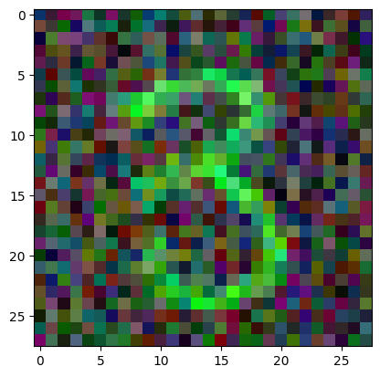

# **Creating Multi Task Models With Keras**

**Author:** Dr. Ronny Guendel  
**Date:** 26th July '24

## **About The Project**

A Keras and TensorFlow library is used to build a deep neural network for creating a multi-task model. The model is designed to detect two features simultaneously from a photo: the number and the predominant color. The MNIST dataset for this project.

It was used with Google Colab but can also be used with jupyter notebook but the Tensorboard might make trouble there.

## **Visual Representation**

**Here, the image contains some noise and a predominant color.**

 

## **Model Architecture**

**The image below represents the architecture as well as the flow of the deep neural network.**

## **Model Prediction**

**Here are some sample images predicted by the model.**

## **Acknowledgement**

- **The Coursera Guided Project** [Creating Multi Task Models With Keras](https://www.coursera.org/projects/multi-task-models-keras)

